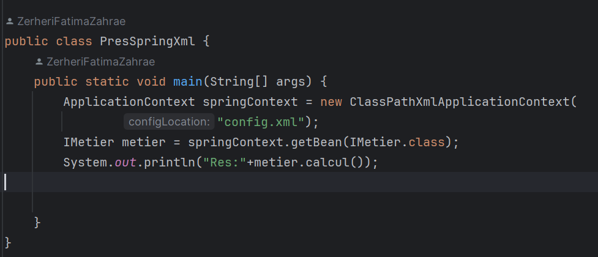

<h1>version de contrôle et Injection des dépendances</h1>
  <h3 style="color:#084C84 ;">Partie 1</h3>
  

    1. Créer l'interface IDao avec une méthode getDate
  

  
 

2. Créer une implémentation de cette interface  
1 er implemntation : version Base de Donnees

2 eme implemntation : version Web Service

3 eme implemntation : version Capteur

3. Créer l'interface IMetier avec une méthode calcul

4. Créer une implémentation de cette interface en utilisant le couplage faible

5. Faire l'injection des dépendances :  
  a. Par instanciation statique

 b. Par instanciation dynamique

Fichier config.txt

c. En utilisant le Framework Spring  
       - Version XML

Fichier config.xml

 - Version annotations

Execution :

